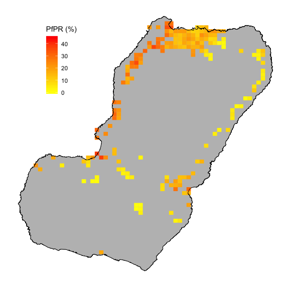
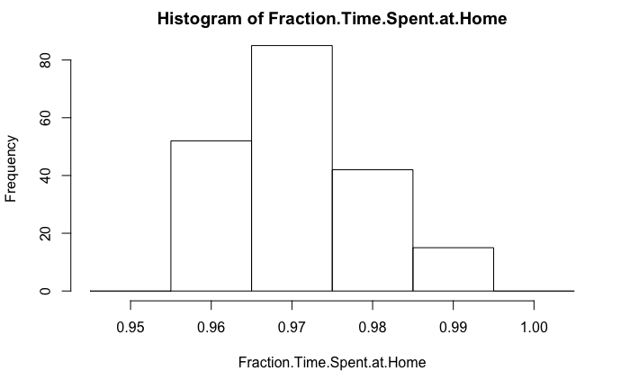
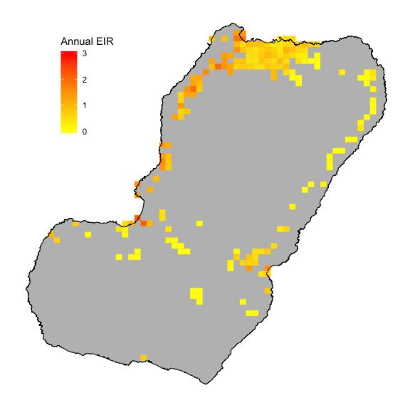

* Estimate map of force of infection as a function of
    * 1 - local (area-level) estimates of PfPR
    * 2 - time at risk at home vs. time at risk in other locations
    * Combining these two things allows us to differentiate between locally-acquired and imported cases of malaria
* Area-level estimates of PfPR
    * Based on MIS survey data from 2015-2017 - RDT results
* Time at Risk
    * Based on MIS survey data from 2015-2017 - travel frequency and destination responses
    * Fit travel frequency using a gravity model, where each area’s travel frequency depends on its local population; the population of the destination; and the distance between the home and destination locations
* Some important caveats:
    * Currently we have travel counts data, but no reports on time spent while traveling in different locations. (2018 MIS should help with this)
    * Currently we treat 6 regions on the island (Malabo, Baney, Luba, Riaba, Moka, Ureka) and mainland EG as destination locations in our travel model.  This is because the travel counts data from 2015-2017 only specifies the region where they traveled to, not where within that region. (2018 MIS should help with this)
    * Currently we are assuming that each group of survey respondents is representative of the area they belong to - our next step is to account for the uncertainty introduced by the survey sampling with a more sophisticated model.
* The PfPR estimates, the travel frequency estimates, and the estimates of time spent at each destination all have associated uncertainties - we can use this framework to propagate these uncertainties through the model

Surface map of mean estimates of PfPR on Bioko Island

Histogram of fraction of time spent at home

Mean Force of Infection (FOI) map, plotted in units of annual FOI created using combination of PfPR estimates and Time at Risk

