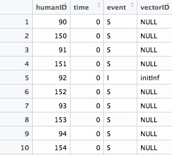
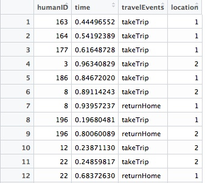
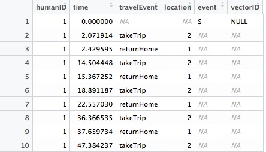
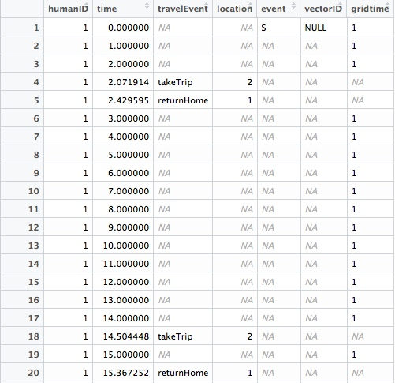
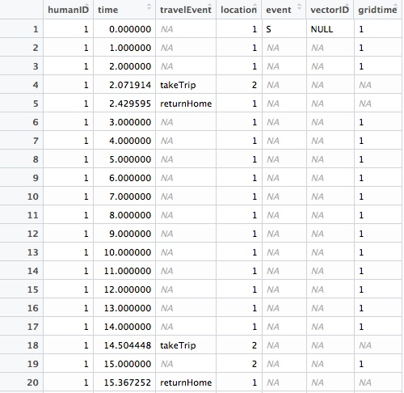
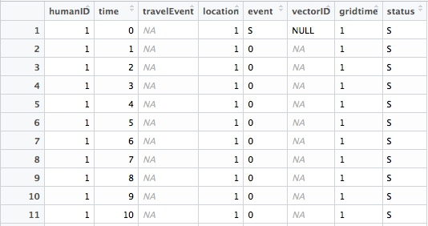
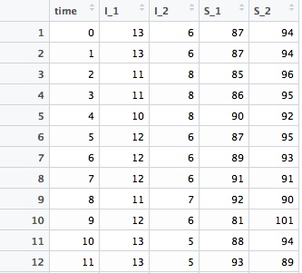

# Tutorial in Data Transformation

#### - Daniel Citron, 2/14/2018 - with a lot of help from David Phillips and Kelly Cercy

<dl><hr></dl>

### Summary

If we implement a MASH-MACRO simulation with multiple patches and a nontrivial human migration model, the output includes two separate tables containing information on human movement and human health statuses.  Here, I explain how I used R's `data.table` package to combine those two data sets in order to obtain S-I curves.

This analysis was produced using the script `Multipatch-test.R` to generate a sample data set.  These simulations include two patches with 100 people each.

### The Initial Data

* HumanPathogen_Run0.csv - this logs the **events** happening to each `Human` over time.  We will need to track the history of each `Human` in order to determine that human's **status**.  The complication here is that this table includes no information about where each `Human` was located at the time of each event.



* HumanMove_Run0.csv - this logs the **movement** happening to each `Human` over time.  By combining this data set with the other, we can figure out the number of infected, susceptible, protected, vaccinated people in each patch at each point in time.



The goal here is to be able to read off **Parasite Rate** - the fraction of infected individuals - from each patch over time.

### Data Transformation


#### Step 1: Bind the two data sets together

In the human movement data set, rename one of the columns so that we can distinguish between logs of health status events and logs of movement events.

```R
setnames(human.move, "event", "travelEvent")
```

Bind the two data sets together, and sort all events by time.

```R
tmp1 = rbind(human.move, human.pathogen, fill=T)
tmp1 = tmp1[order(humanID, time)]
```



#### Step 2: Discrete Time

We are now going to add a new set of time steps representing discrete time. Essentially, we will be counting the number of infected or susceptible individuals in each patch *at the end of each day*.  The `gridtime` variable allows us to keep track of which time steps are discrete and which are not.
```R
gridtime = data.table(humanID=unique(tmp1$humanID),
time=rep(seq(0, tMax, by=1), length(unique(tmp1$humanID))),
gridtime=1)
```

Merge with the other table
```R
tmp2 <- merge(tmp1, gridtime, by=c('humanID','time'), all=TRUE)
```
Sorting by `humanID`:




#### Step 3: Fill in Missing Data
There are a lot of `NA`'s appearing in our data, and so the next step is to fill in these missing data points with information that we can use.

We start by filling in the initial location (`patch_id` at time=0) for each of the humans:
```R
initLoc = data.table(humanID=unique(newdata$humanID),
                     time = 0.0, location = patch_id)
tmp2[, location:= as.integer(location)]
tmp2[time==0]$location <- initLoc$location[tmp2[time==0]$humanID]
```

Using the `zoo` package in R, we can now fill in the current location of each human over time.  This fills in all `NA`'s in the `location` column with the last non-`NA` value:
```R
tmp2 <- transform(tmp, location=na.locf(location))
```


#### Step 4: Translate Logged Events into Current Statuses
We now create a column to keep track of the current status of each `Human`.  We define a function `log.2.status` to translate logged health events into the current health status of each `Human`, and use that function in each row where a logged health event occurs.

Set all `NA`'s to 0 in the `event` column.  These will be transformed back into `NA` by `log.2.status`:
```R
tmp3$event[is.na(tmp3$event)] = 0
```
Create the new `status` column:
```R
tmp3[, status := sapply(tmp3$event, log.2.status)]
```
Use the same trick from the `zoo` package to fill in all `NA` values with the last non-`NA` value:
```R
tmp3 <- transform(tmp3, status=na.locf(status))
```

Last, pull out only the final event that occurs at each of the discrete-time values (in case there is more than one status change that occurs in a given time step):
```R
tmp4 <- tmp3[tmp3$gridtime==1]
tmp4 <- tmp4[order(time, humanID)]
setkey(tmp4, "humanID")
# Subset of x's Data for each group, taking the final element
tmp4 <- tmp4[, .SD[.N], by = c("time", "humanID")]
```

We are left with a table with the location and health status of each individual for each day in the simulation.



#### Step 5: Aggregate Individuals by Location and Health Status
Use `.N` in `data.table` to count the number of individuals at each location, at each time, with a given health status:
```R
tmp5 = tmp4[gridtime==1, .N, by=.(location, time, status)]
```


Now, use `dcast` to transform the data such that each row is one time step and each column counts the number of individuals by health status in each location:
```R
tmp6 <- dcast(tmp5, time ~  status + location, value.var="N")
```



And from here, it is straightforward to plot the S-I curves for each of the patches in the simulation.

```R
ggplot(data = tmp5) +
  geom_line(mapping = aes(x = time, y = N, color = status)) +
  facet_wrap(~location, ncol = 2, labeller = label_parsed) +
  scale_color_manual(name = "Status",
                       values = c("#ff0000", "#000cff"),
                       breaks = c("I", "S"),
                       labels = c("Infected (PR)", "Susceptible")) +
  xlim(0,500) + ylim(0,120) +
  xlab("Time") + ylab("N")
```


